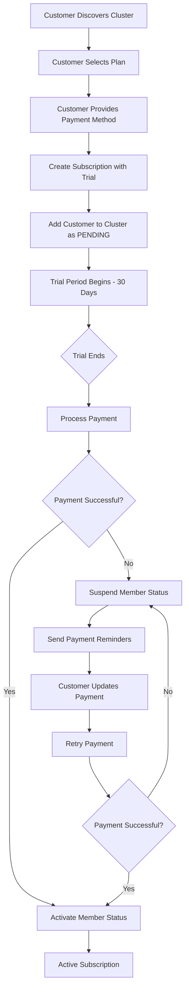

# Subscription Flow Documentation

## Overview

This document describes the improved subscription flow for customers subscribing to hosts in the MowthosOS platform. The new flow ensures customers pay only after their trial period ends, with proper payment verification and cluster membership management.

## Key Features

- ✅ **30-day trial period** for all subscription plans
- ✅ **No immediate charge** - customers pay only after trial ends
- ✅ **Payment verification** before cluster membership
- ✅ **Automatic status updates** based on payment status
- ✅ **Plan upgrades/downgrades** with proration
- ✅ **Failed payment handling** with suspension

## Flow Overview



## API Endpoints

### 1. Create Pre-Join Subscription

**Endpoint:** `POST /api/v1/payments/subscriptions/pre-join`

**Purpose:** Create a subscription with trial period before joining cluster

**Request:**
```json
{
    "cluster_id": "550e8400-e29b-41d4-a716-446655440000",
    "plan_id": "550e8400-e29b-41d4-a716-446655440001",
    "payment_method_id": "pm_test_4242424242424242",
    "address_id": "550e8400-e29b-41d4-a716-446655440003"
}
```

**Response:**
```json
{
    "subscription_id": "c3911aa1-9fc6-457e-a095-5d557854ab14",
    "member_id": "03656ad9-39b1-4b65-b673-94a7e9bb1281",
    "status": "pending",
    "trial_start": "2025-08-01T23:06:58.840437",
    "trial_end": "2025-08-31T23:06:58.840447",
    "message": "Subscription created with 30-day free trial. You will be charged after the trial period."
}
```

### 2. Get Subscription Details

**Endpoint:** `GET /api/v1/payments/subscriptions/{subscription_id}`

**Purpose:** Get subscription details including trial status

**Response:**
```json
{
    "subscription_id": "c3911aa1-9fc6-457e-a095-5d557854ab14",
    "status": "trialing",
    "trial_start": "2025-08-01T23:06:58.840437",
    "trial_end": "2025-08-31T23:06:58.840447",
    "current_period_start": "2025-08-01T23:06:58.840437",
    "current_period_end": "2025-08-31T23:06:58.840447",
    "monthly_price": 29.99,
    "currency": "USD",
    "plan": {
        "id": "550e8400-e29b-41d4-a716-446655440001",
        "name": "Basic Plan",
        "mowing_frequency": "weekly",
        "included_services": ["mowing", "edge_trimming"]
    },
    "cluster_member": {
        "member_id": "03656ad9-39b1-4b65-b673-94a7e9bb1281",
        "status": "pending",
        "join_order": 1
    },
    "is_trial_active": true
}
```

### 3. Update Subscription Plan

**Endpoint:** `POST /api/v1/payments/subscriptions/{subscription_id}/update-plan`

**Purpose:** Upgrade or downgrade subscription plan

**Request:**
```json
{
    "new_plan_id": "upgrade_plan_id",
    "effective_date": "2025-09-01T00:00:00Z"  // Optional, defaults to next billing cycle
}
```

**Response:**
```json
{
    "subscription_id": "c3911aa1-9fc6-457e-a095-5d557854ab14",
    "new_plan_id": "upgrade_plan_id",
    "new_plan_name": "Premium Plan",
    "effective_date": "2025-08-31T23:06:58.840447",
    "message": "Plan updated successfully"
}
```

### 4. Cancel Subscription

**Endpoint:** `POST /api/v1/payments/subscriptions/{subscription_id}/cancel`

**Purpose:** Cancel subscription (immediate or end of period)

**Query Parameters:**
- `immediate`: Boolean (default: false) - Cancel immediately or at period end

**Response:**
```json
{
    "status": "cancelled",
    "cancel_at_period_end": true,
    "current_period_end": "2025-08-31T23:06:58.840447"
}
```

## Database Models

### Subscription Status Flow

```python
class SubscriptionStatus(str, Enum):
    ACTIVE = "active"           # Paid and active
    TRIALING = "trialing"       # In trial period
    PAST_DUE = "past_due"       # Payment failed, retrying
    CANCELLED = "cancelled"     # Cancelled by user
    EXPIRED = "expired"         # Trial expired without payment
    PAUSED = "paused"          # Temporarily paused
```

### Cluster Member Status Flow

```python
class MemberStatus(str, Enum):
    PENDING = "pending"         # Trial active, waiting for payment
    ACTIVE = "active"           # Paid and active member
    SUSPENDED = "suspended"     # Payment failed, suspended
    REMOVED = "removed"         # Cancelled or removed
```

## Webhook Events

### Stripe Webhook Handling

The system handles the following Stripe webhook events:

1. **`customer.subscription.created`** - New subscription created
2. **`customer.subscription.updated`** - Subscription status changed
3. **`customer.subscription.deleted`** - Subscription cancelled
4. **`invoice.payment_succeeded`** - Payment successful
5. **`invoice.payment_failed`** - Payment failed

### Status Updates

When webhook events are received, the system automatically updates:

- **Subscription status** in the database
- **Cluster member status** based on payment status
- **Trial period tracking**
- **Billing cycle dates**

## Trial Period Management

### Trial Configuration

- **Duration:** 30 days for all plans
- **No immediate charge:** Payment method is authorized but not charged
- **Service access:** Full service access during trial
- **Automatic conversion:** Trial converts to paid subscription automatically

### Trial End Process

1. **7 days before trial ends:** Send payment reminder email
2. **3 days before trial ends:** Send SMS reminder
3. **Trial ends:** Process payment from saved method
4. **Payment succeeds:** Activate member status
5. **Payment fails:** Suspend member status and send notifications

## Failed Payment Handling

### Payment Failure Flow

1. **Payment fails** after trial ends
2. **Member status** changes to `SUSPENDED`
3. **Service access** is restricted
4. **Notifications sent** via email and SMS
5. **Retry attempts** every 3 days for 30 days
6. **Final failure** after 30 days: subscription cancelled

### Recovery Process

1. **Customer updates** payment method
2. **System retries** payment automatically
3. **Payment succeeds:** Member status restored to `ACTIVE`
4. **Service access** restored immediately

## Plan Management

### Plan Types

```python
class ClusterSubscriptionPlan(Base):
    name: str                    # "Basic Plan", "Premium Plan"
    monthly_price: Decimal       # 29.99, 49.99
    mowing_frequency: str        # "weekly", "biweekly", "monthly"
    max_lawn_size_sqm: int      # 1000, 2000, unlimited
    included_services: List[str] # ["mowing", "edge_trimming", "leaf_removal"]
    priority_scheduling: bool    # True for premium plans
```

### Plan Upgrade/Downgrade

- **Immediate proration:** Price changes are prorated
- **Feature changes:** New features available immediately
- **Billing cycle:** Changes effective next billing cycle by default
- **No interruption:** Service continues during plan changes

## Security Considerations

### Payment Security

- **Stripe integration:** All payments processed through Stripe
- **PCI compliance:** No card data stored in our database
- **Webhook verification:** All webhooks verified with Stripe signature
- **Encryption:** All sensitive data encrypted in transit and at rest

### Access Control

- **User verification:** Only subscription owners can modify their subscriptions
- **Cluster verification:** Users can only join clusters they're invited to
- **Plan validation:** Only active plans can be selected
- **Status validation:** Proper status transitions enforced

## Monitoring and Alerts

### Key Metrics

- **Trial conversion rate:** Percentage of trials that convert to paid
- **Payment failure rate:** Percentage of payments that fail
- **Plan upgrade rate:** Percentage of users who upgrade plans
- **Churn rate:** Percentage of users who cancel subscriptions

### Alerts

- **High payment failure rate:** Alert when >10% of payments fail
- **Low trial conversion:** Alert when <20% of trials convert
- **Webhook failures:** Alert when Stripe webhooks fail
- **Service disruptions:** Alert when subscription services are down

## Testing

### Test Scenarios

1. **Happy path:** Customer completes full subscription flow
2. **Payment failure:** Customer's payment fails after trial
3. **Plan upgrade:** Customer upgrades from basic to premium
4. **Plan downgrade:** Customer downgrades from premium to basic
5. **Cancellation:** Customer cancels subscription
6. **Recovery:** Customer recovers from failed payment

### Test Data

Use the test script `test_subscription_flow.py` to verify the complete flow:

```bash
python3 test_subscription_flow.py
```

## Implementation Notes

### Database Migrations

Ensure the following database tables exist:

- `subscriptions` - Subscription records
- `cluster_members` - Cluster membership records
- `cluster_subscription_plans` - Available plans
- `payment_methods` - User payment methods
- `invoices` - Billing invoices
- `payments` - Payment transactions

### Environment Variables

Required environment variables:

```bash
STRIPE_SECRET_KEY=sk_test_...
STRIPE_WEBHOOK_SECRET=whsec_...
STRIPE_PUBLISHABLE_KEY=pk_test_...
```

### Dependencies

Required Python packages:

```bash
pip install stripe fastapi sqlalchemy pydantic
```

## Future Enhancements

### Planned Features

1. **Annual billing:** Support for annual subscription plans
2. **Usage-based billing:** Charge based on actual mowing hours
3. **Family plans:** Multiple addresses under one subscription
4. **Referral bonuses:** Discounts for referring new customers
5. **Loyalty program:** Rewards for long-term customers

### Technical Improvements

1. **Real-time notifications:** WebSocket updates for subscription changes
2. **Advanced analytics:** Detailed subscription analytics dashboard
3. **A/B testing:** Test different trial periods and pricing
4. **International support:** Multi-currency and localization
5. **Mobile app integration:** Native mobile subscription management 